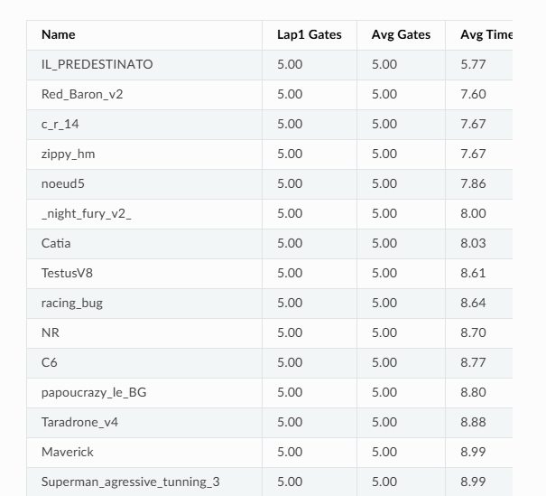

# Autonomous Crazyflie Gate Racing

**EPFL — MICRO-502 Crazy Practical | Individual Simulation Project**

Autonomous drone-racing controller developed for a **Crazyflie quadrotor** in the Webots simulator.

Course documentation: https://micro-502.readthedocs.io

The task consisted of three laps around five randomly positioned gates:

- **Lap 1:** detect and localize the unknown gates using onboard vision
- **Laps 2–3:** reuse the mapped gate positions and complete the course as quickly as possible

## Result

🏁 **13th in the class** with an average simulation time of **8.88 s**, successfully completing all five gates.



## Approach

### Vision & Gate Localization
- OpenCV-based color segmentation and contour filtering
- Visual target locking for robust gate tracking
- Multi-view triangulation to estimate gate positions
- Gate locations stored during the first lap

### Autonomous Navigation
- State-machine-based search, scanning, tracking, and gate traversal
- Pre- and post-gate waypoints for reliable passage
- Reuse of detected gate positions for subsequent laps

### Fast Timed Laps
- Smooth polynomial trajectory generation
- Distance- and turn-based waypoint timing
- Adaptive trajectory lookahead
- Gate-corridor guidance for reliable high-speed traversal

### Low-Level Control
- Cascaded PID control for position, velocity, attitude, and body rates
- Tuned PID gains and command limits for faster course completion

## Repository Structure

```text
src/
├── my_assignment.py      # Vision, gate localization, navigation and trajectory planning
└── ex1_pid_control.py    # Cascaded PID control and tuning

results/
└── ranking.png           # Final simulation leaderboard result
```

## Technologies

**Python · OpenCV · NumPy · SciPy · PID Control · Computer Vision · Trajectory Planning · Webots · Crazyflie**

## Note

The Webots environment, Crazyflie model, supporting libraries, and starter framework were provided as part of the **EPFL MICRO-502 Crazy Practical** project.

This repository contains the two files I modified for my individual simulation solution.
